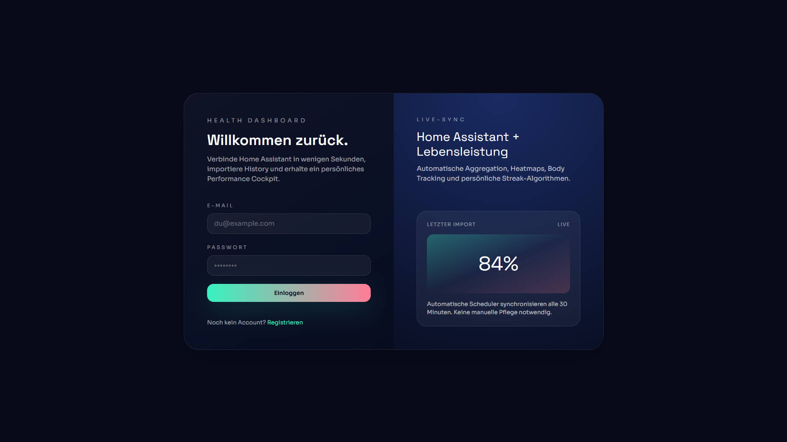
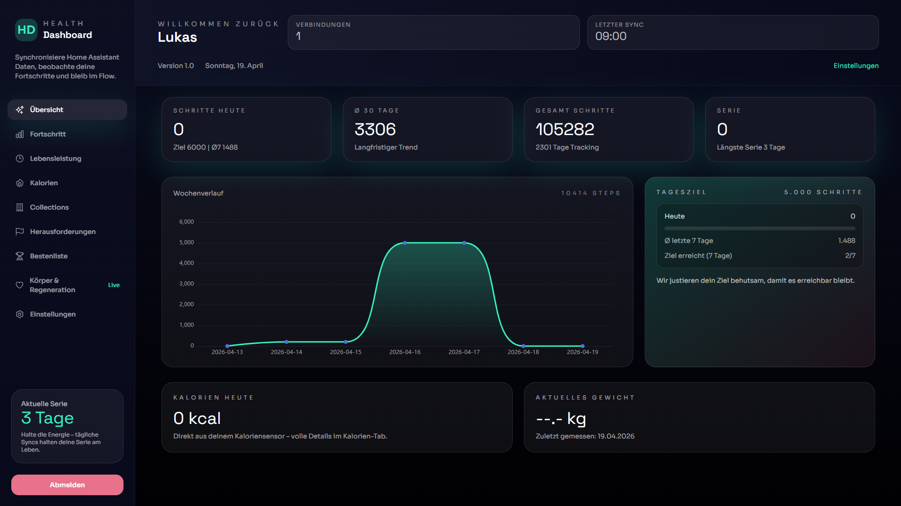
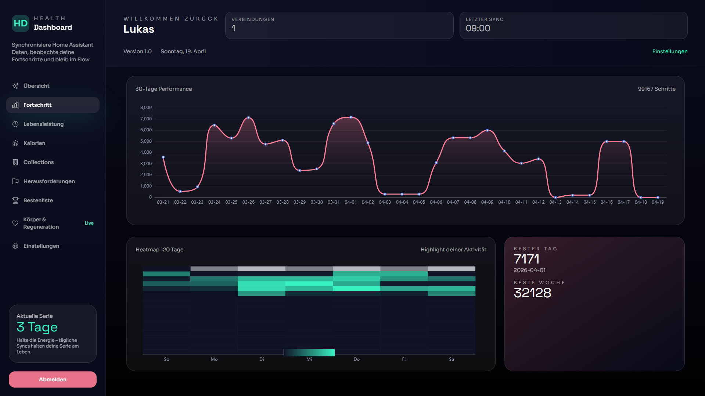
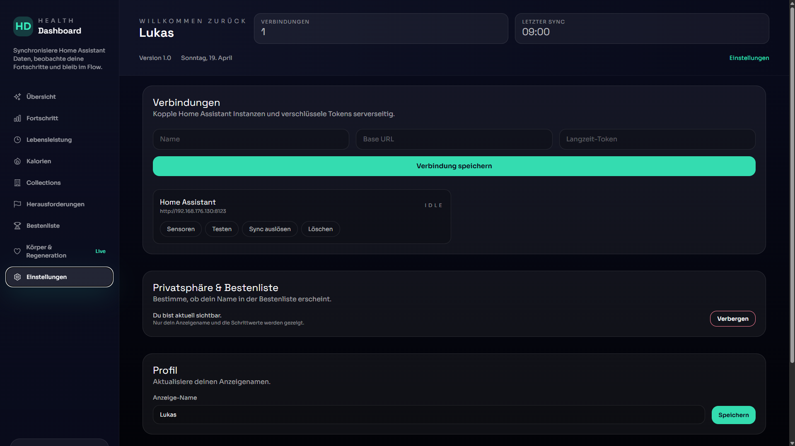

# Healthy – Smart Home Health Dashboard

*Available in German: [README.de.md](README.de.md).*

**Tagline:** AI-built health dashboard for Home Assistant that turns raw sensor history into motivating daily insights, gamified collections, and a privacy-first personal fitness hub.

Healthy is a full-stack Health Dashboard for Home Assistant power users. It connects to your sensors via the HA REST API, stores normalized daily snapshots (Fastify + Prisma + SQLite) and renders a premium Vue 3 interface with Collections Blueprint, Leaderboard, EVA guidance, adaptive challenges, and calorie insights – all deployable via a single Docker container.

> Want the storytelling version? Check out `SMART-HOME-GUIDE.md`.

> Transparency: this is an AI-generated practice project – details in [AI-TRANSPARENCY.md](AI-TRANSPARENCY.md).

## Feature Highlights

- 🔐 **Secure HA connections** – Multiple instances, AES-256-GCM encrypted tokens.
- 📡 **Sensor mapping** – Steps, distance, weight, active minutes, calories with unit hints.
- 📈 **Historical import & scheduler** – Imports via `/api/history/period`, cron every 30 min + nightly.
- 🏗 **Collections Blueprint** – EVA narrates requirements & progress, responsive layout.
- 🏆 **Leaderboard & daily challenges** – Opt-in visibility, adaptive goals, calorie panel & references.

## Screenshots

| Login | Dashboard |
| --- | --- |
|  |  |

| Progress | Settings |
| --- | --- |
|  |  |

## Architecture

- **Backend:** Fastify · Prisma · SQLite (WAL) · node-cron · JWT · AES-256-GCM
- **Frontend:** Vue 3 · Pinia · Vite · Tailwind CSS · ECharts
- **Deployment:** Multi-stage Dockerfile + `docker-compose.yml`, persistent `./data/app.db`

```
Healthy/
├─ backend/              # Fastify API, Scheduler, Prisma Client
├─ frontend/             # Vue 3 SPA (Vite)
├─ data/                 # SQLite volume
├─ docker-compose.yml    # Single-container deployment
├─ Dockerfile            # Multi-stage build (frontend → backend)
├─ .env.example          # Shared env reference
├─ README.de.md          # German docs
└─ SETUP.md / SETUP.de.md# Installation guides (EN/DE)
```

## Quick Start (Docker / Portainer)

1. Copy `.env.example` to `.env` and fill in secrets (`DB_URL=file:../../data/app.db` must stay).
2. Build & run:

   ```bash
   docker compose up --build -d
   ```

3. Open `http://localhost:3000`, register the first user.
4. Add your Home Assistant connection (token, base URL), map sensors, trigger import.

> Portainer: create a Stack with `docker-compose.yml`, set env vars in the UI (no files created). Mount `./data:/app/data` for persistence.

## Local Development

```bash
git clone https://github.com/lkn94/Healthy.git
cp .env.example .env

# Backend
cd backend
npm install
npm run migrate:dev
npm run dev

# Frontend (new terminal)
cd ../frontend
npm install
npm run dev -- --host
```

- API: `http://localhost:3000`
- SPA: `http://localhost:5173` (proxying `/api`)

## Environment Variables

| Key | Description |
| --- | --- |
| `APP_PORT` | Fastify listen port (default 3000) |
| `JWT_SECRET` | ≥16 chars for JWT signatures |
| `ENCRYPTION_KEY` | 32 chars for AES-256-GCM token encryption |
| `DB_URL` | Prisma DSN, e.g. `file:../../data/app.db` |
| `SYNC_INTERVAL_MINUTES` | Scheduler interval (default 30) |
| `DEFAULT_DAILY_GOAL` | UI hint for steps |
| `DEFAULT_STEP_LENGTH_METERS` | Fallback for distance calculation |
| `VITE_API_URL` | Frontend base URL (`/api` in Docker, `http://localhost:3000/api` in dev) |

## Home Assistant Onboarding

1. **Create token** – Profile → Long-lived access tokens.
2. **Add connection** – Healthy → Settings → Connections → Name, HA base URL (with schema/port), token.
3. **Map sensors** – Steps (kumulativ pro Tag), distance, weight, active minutes, calories.
4. **Run import** – Choose a start date, click “Historie importieren” → Healthy fetches `/api/history/period` and stores daily snapshots.
5. **Scheduler** – Cron job syncs every 30 min + nightly. Monitor via “Sync-Status”.

Detailed walkthrough (incl. Portainer, troubleshooting) lives in [SETUP.md](SETUP.md) → German version: [SETUP.de.md](SETUP.de.md).

## Data Flow

1. Sync runner fetches HA history in day-sized chunks.
2. `buildDailySnapshots` normalizes data, writes to `daily_health_snapshot`.
3. Frontend stores read-only API responses (Pinia) and renders charts/collections.

## Useful npm Scripts

| Path | Script | Purpose |
| --- | --- | --- |
| `backend/` | `npm run dev` | Fastify + ts-node-dev |
|  | `npm run build` | Compile to `dist/` |
|  | `npm run migrate:dev` / `migrate:deploy` | Prisma migrations |
|  | `npm run generate` | Regenerate Prisma client |
| `frontend/` | `npm run dev` | Vite dev server |
|  | `npm run build` | Production build |
|  | `npm run preview` | Preview built SPA |

## API Overview

| Route | Purpose |
| --- | --- |
| `POST /api/auth/register` · `login` | Authentication |
| `GET/POST /api/connections` | Manage HA instances |
| `GET /api/connections/:id/entities` | List HA entities |
| `POST /api/connections/:id/mapping` | Persist sensor mapping |
| `POST /api/connections/:id/import` | Kick off historical import |
| `POST /api/connections/:id/sync` | Immediate sync |
| `GET /api/connections/:id/sync-status` | Job state + stats |
| `GET /api/dashboard/*` | Overview, progress, body, calories, collections |
| `PATCH /api/user/settings|profile|password` | Leaderboard opt-in, display name, password |

## Troubleshooting

- **No history pulled** – Increase HA `recorder.purge_keep_days`, ensure the sensor reports daily values.
- **“Access denied”** – Token expired or wrong URL; recreate long-lived token, include schema & port.
- **Scheduler stuck on “syncing”** – Check `/sync-status`, inspect backend logs, trigger manual sync if needed.
- **Frontend can’t reach API** – Verify `VITE_API_URL`. In Docker it must be `/api`; in dev use the full backend origin.
- **Port conflict** – Change `APP_PORT`, rerun compose.

## Further Reading

- `SMART-HOME-GUIDE.md` – Product story & marketing copy
- `README.de.md` – German documentation
- `SETUP.md` / `SETUP.de.md` – Installation how-to (EN/DE)
- `backend/src/services/maintenance.ts` – Automatic data maintenance & resync logic

Happy launching! 🚀
